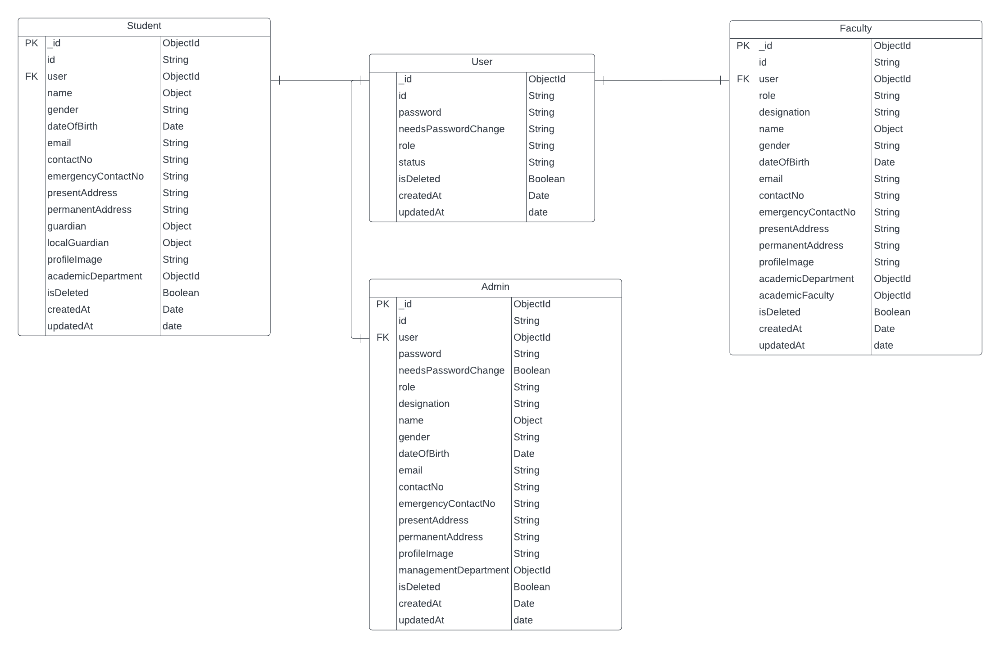
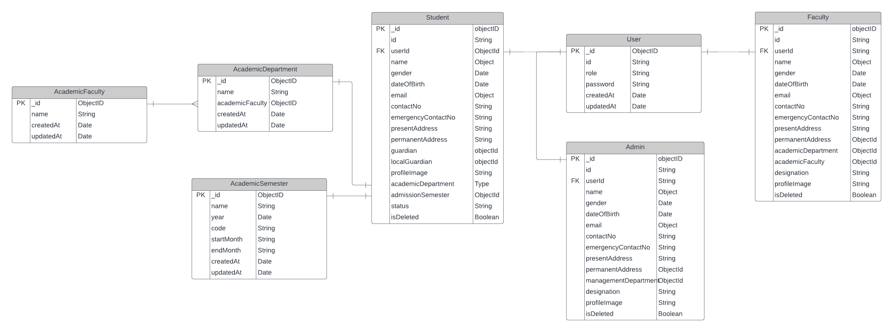

### Requirement Analysis

[Link to Requirement Analysis Document](https://docs.google.com/document/d/10mkjS8boCQzW4xpsESyzwCCLJcM3hvLghyD_TeXPBx0/edit?usp=sharing)

Description: This document outlines the detailed analysis of project requirements.

---

### Entity-Relationship Diagrams

#### Diagram 1

Description: This is a basic diagram illustrates the relationships between entities in the system. Key entities and their connections are visually represented.

#### Diagram 2

Description: The third ER diagram adds further complexity, depicting relationships to the overall system architecture.

---
